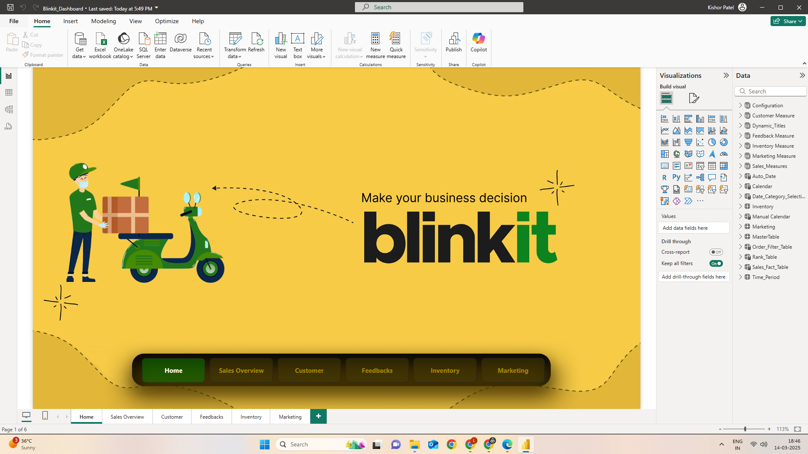
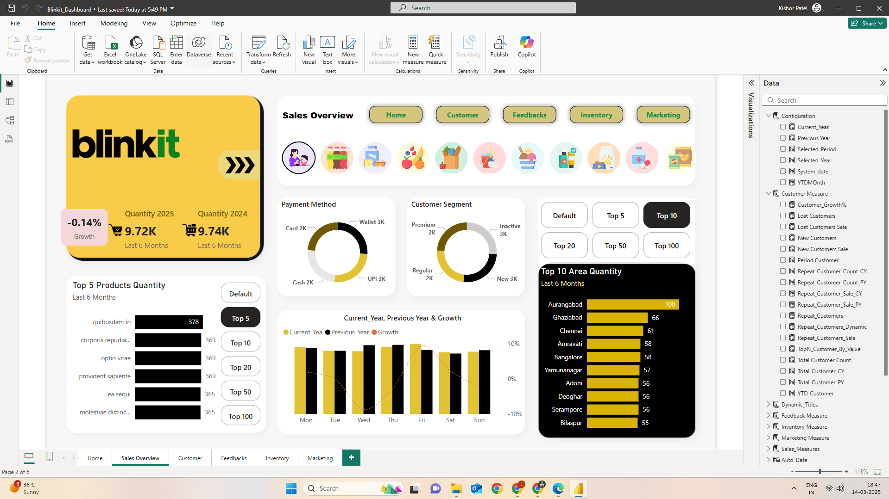
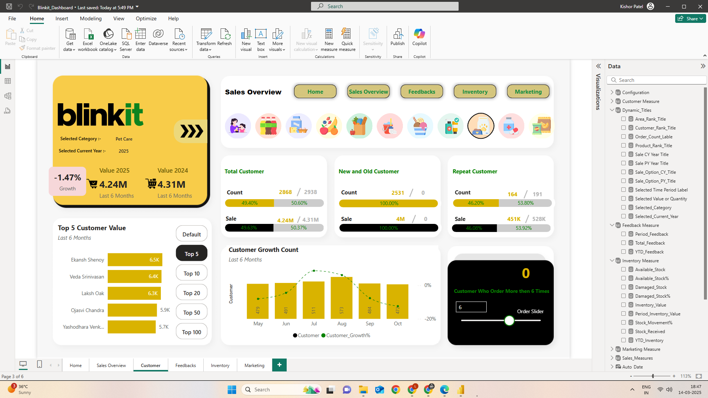
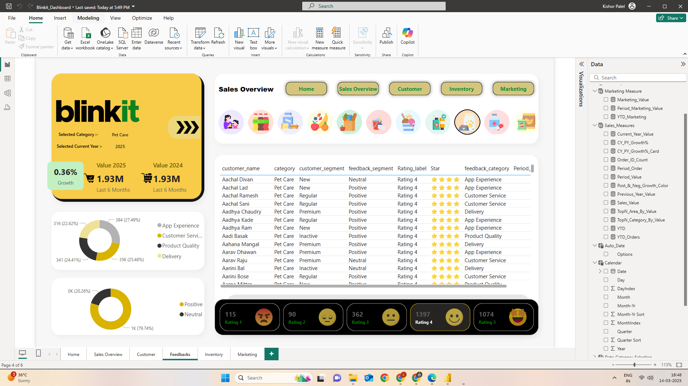
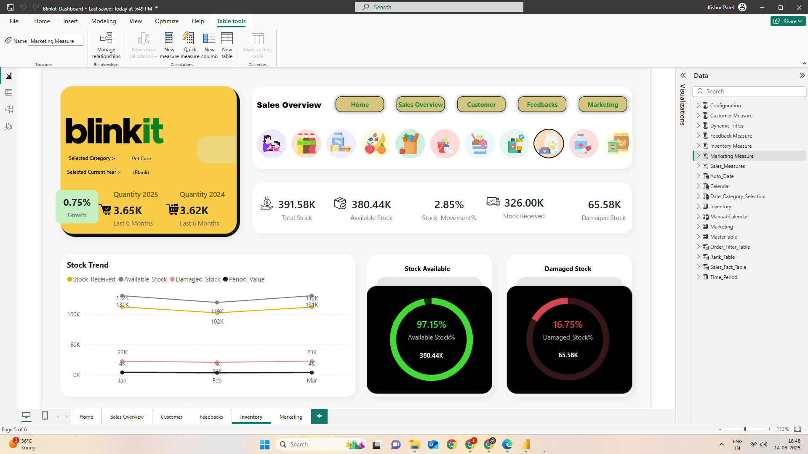
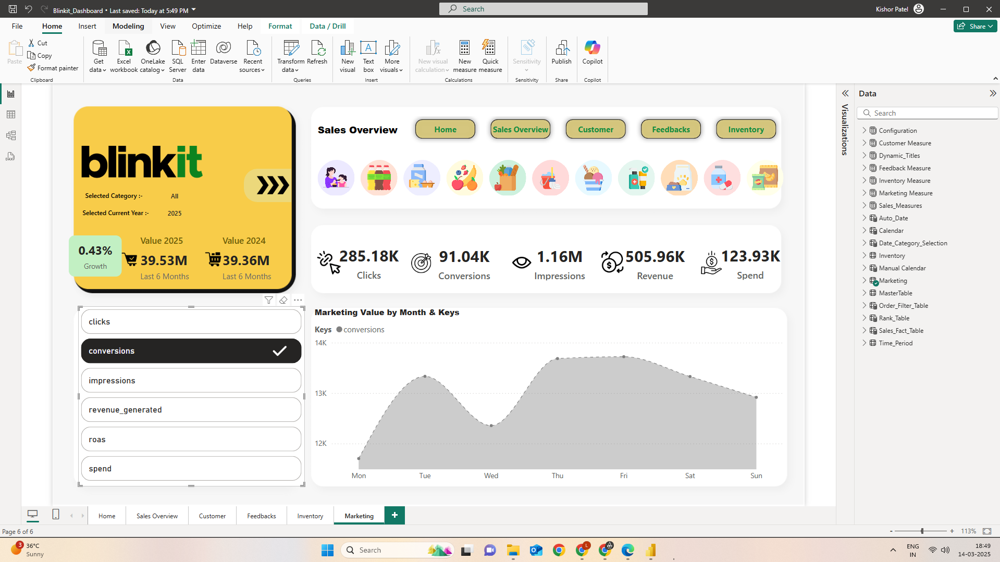
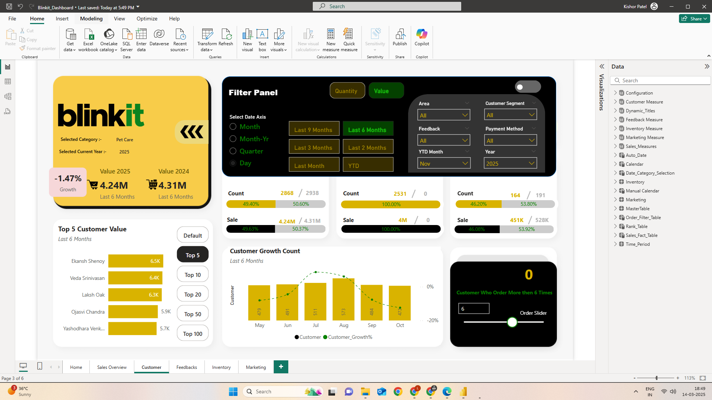
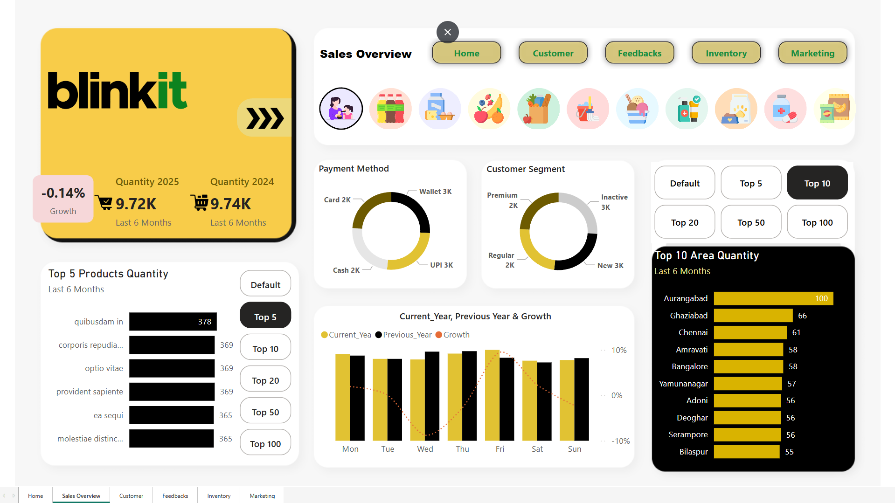

# 🛒 Blinkit Sales & Performance Dashboard | Power BI

## 📊 Project Overview

The Blinkit Dashboard is an interactive, multi-page Power BI report that analyzes a quick-commerce business across **sales, customers, feedback, inventory and marketing**. It uses a custom navigation menu, category icons, dynamic titles and a filter panel, so the whole report responds to the selections a user makes.


---

## 🎯 Business Requirement

The dashboard is designed to answer questions such as:

- How do quantity and sales compare with the previous year?
- Which products, categories and areas sell the most?
- Which payment methods and customer segments drive orders?
- Who are the most valuable customers, and how many are new, repeat or lost?
- What do customers say about delivery, product quality, service and the app?
- How much stock is available, received and damaged?
- How well do marketing campaigns convert and what do they return?

---

## 🛠️ Tools & Technologies

- Power BI Desktop
- Power Query
- DAX
- Data Modeling
- CSV datasets

---

## 📁 Dataset

Generated by `Data_Generator/DataCreator.py` (orders from 2022 to 2025):

| File | Description |
|------|-------------|
| `blinkit_orders.csv` | Order-level data |
| `blinkit_order_items.csv` | Items in each order |
| `blinkit_customers.csv` | Customer details and segments |
| `blinkit_products.csv` | Product catalog and categories |
| `blinkit_inventory.csv` | Stock received, available and damaged |
| `blinkit_delivery_performance.csv` | Delivery performance |
| `blinkit_customer_feedback.csv` | Ratings and feedback categories |
| `blinkit_marketing_performance.csv` | Clicks, conversions, impressions, spend, revenue, ROAS |

---

## 🗂️ Data Model

The report is built on a fact and dimension model with separate tables for measures and for dynamic dashboard behaviour:

| Table | Purpose |
|-------|---------|
| `Sales_Fact_Table`, `MasterTable` | Core sales and order data |
| `Inventory`, `Marketing` | Inventory and marketing data |
| `Calendar`, `Manual Calendar` | Date analysis |
| `Time_Period`, `Date_Category_Selection` | Dynamic time-period and axis selection |
| `Rank_Table`, `Order_Filter_Table` | Top N ranking and order-count filtering |
| `Dynamic_Titles` | Titles that change with the selected category and year |
| `Configuration` | Current year, previous year, selected period, YTD month |
| `Customer Measure`, `Feedback Measure`, `Inventory Measure`, `Marketing Measure`, `Sales_Measures` | DAX measure tables |

---

## 📊 Dashboard Pages

The report has 6 pages, linked by a navigation menu.

### 1. Home

A landing page with the Blinkit branding and buttons to jump to every section.



### 2. Sales Overview

- Quantity for 2025 vs 2024 (last 6 months) with a growth badge
- Payment Method donut (Wallet, UPI, Card, Cash)
- Customer Segment donut (Premium, Regular, New, Inactive)
- Top 5 products by quantity
- Top 10 areas by quantity
- Current year vs previous year by weekday, with a growth line
- Top N buttons (Default, 5, 10, 20, 50, 100) and category icon selector



### 3. Customer

- Total, new and old, and repeat customer counts with sales split
- Top 5 customers by value, with Top N buttons
- Customer growth count by month
- Order slider that counts customers who ordered more than a chosen number of times



### 4. Feedbacks

- Feedback table with customer, category, segment, sentiment and star rating
- Feedback category donut (App Experience, Customer Service, Product Quality, Delivery)
- Sentiment donut (Positive and Neutral)
- Rating counts from 1 to 5



### 5. Inventory

- Total, available, received and damaged stock
- Stock movement percentage
- Monthly stock trend
- Available stock % and damaged stock % gauges



### 6. Marketing

- Clicks, conversions, impressions, revenue and spend
- Metric slicer (clicks, conversions, impressions, revenue, ROAS, spend)
- Marketing value trend by weekday



---

## 🎛️ Interactive Filter Panel

A slide-out filter panel controls the whole report:

- **Metric toggle:** Quantity or Value
- **Date axis:** Month, Month-Yr, Quarter, Day
- **Time period:** Last 9, 6, 3, 2 months, Last Month, YTD
- **Slicers:** Area, Customer Segment, Feedback, Payment Method, YTD Month, Year
- **Category selector:** icons for each product category



---

## 🌐 Web App

The dashboard is also published as a web page with a fullscreen view.




---

## 🔍 Sample Observations

These values come from the screenshots and change with the filters selected (category, year, period):

- Quantity for the last 6 months was **9.72K in 2025** vs **9.74K in 2024**, a growth of **-0.14%**.
- Payment methods are fairly evenly spread across Wallet, UPI, Card and Cash.
- **Aurangabad** is the top area by quantity, followed by Ghaziabad and Chennai.
- In the Pet Care view, total customers were **2,868** vs 2,938 in the previous period.
- Feedback is mostly positive (about **79.7%**), and **Rating 4** is the most common rating.
- Inventory shows **391.58K** total stock, with **97.15%** of it available.
- Marketing shows **285.18K clicks**, **91.04K conversions** and **505.96K** revenue against **123.93K** spend.

> **Note:** Because the data is synthetically generated, the product names and numbers are for demonstration only and do not represent real Blinkit data.

---

## 💼 Business Impact

- Track sales growth against the previous year
- Identify top products, customers and areas
- Understand payment and customer segment mix
- Monitor customer satisfaction by feedback category
- Reduce stock wastage by watching damaged stock
- Evaluate marketing spend against conversions and revenue

---

## 🚀 Future Scope

- Delivery time analysis using the delivery performance data
- Demand forecasting
- Customer churn prediction
- Real-time data connection
- Row-level security for different teams

---

## 📂 Project Structure

```
Blinkit-Dashboard-PowerBI/
│
├── README.md
│
├── Dashboard/
│   ├── Blinkit_Dashboard.pbix
│   └── Background Images/
│
├── Data_Generator/
│   ├── DataCreator.py
│   └── *.csv
│
└── Screenshot/
    ├── 1.png ... 6.png
    ├── Filter.png
    ├── Webapp.png
    ├── Webapp2.png
    ├── Blinkit_Dashboard.docx
    └── Blinkit_Dashboard.pdf
```

---

## 🙌 Credits

Original dashboard created by **Anil Matholiya** ("Dataverse Anil").

Original repository: *(add the link to the original repo here)*

---

## 👨‍💻 Uploaded by

**Nallamothu Abhiram**
B.Tech – Computer Science (AI/ML)

- [GitHub](https://github.com/Abhiram126)
- [LinkedIn](https://www.linkedin.com/in/nallamothu-abhiram-chowdary-12714629b)
